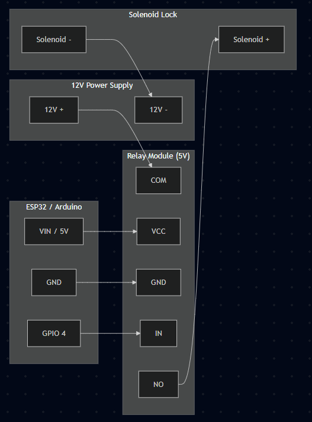

 # Hand Gesture Control for Solenoid Lock: Comprehensive Documentation

This document provides a comprehensive guide to the "Hand Gesture Control for Solenoid Lock" project, detailing its features, setup, usage, and configuration. This project enables the control of solenoid locks using hand gestures detected via computer vision, offering both a straightforward rule-based method and an advanced machine learning approach.

## 1. Project Overview

The `hand-gesture-control-solenoid` project is designed to provide a robust and flexible solution for controlling solenoid locks. It caters to different user needs by offering two distinct methodologies:

*   **Simple Rule-Based Approach**: Ideal for beginners, this method uses predefined hand gestures (open palm for unlock, fist for lock) detected by MediaPipe. **This approach now includes a face recognition gate for enhanced security**, requiring a recognized user to be present before accepting gestures.
*   **Machine Learning Approach**: For advanced users, this method allows for custom gesture training using a neural network, offering high accuracy and extensibility.

Both approaches support various hardware configurations, including ESP32/Arduino for serial communication and Raspberry Pi for direct GPIO control.

## 2. Features 

### 2.1. Simple Approach (`app/gesture_control.py`)

This approach is designed for ease of use and quick deployment.

*   **Face Recognition Gate**: Before accepting any gestures, the system must first recognize a pre-registered "master" face, adding a significant layer of security.
*   **Predefined Gestures**:
    *   **Open palm**: Sends `COMMAND_OPEN` (default `b'1'`) to unlock.
    *   **Fist**: Sends `COMMAND_CLOSE` (default `b'0'`) to lock.
*   **Real-time Detection**: Utilizes MediaPipe for efficient and real-time hand gesture recognition.
*   **Lightweight Processing**: Optimized for single-camera processing.
*   **Serial Communication**: Seamless integration with ESP32/Arduino boards for controlling the solenoid.

### 2.2. Machine Learning Approach (`data_pipeline/dataset_take.py`, `training/train.ipynb`, `app/predict.py`)

This advanced approach offers dynamic sequence recognition, custom gesture training, and robust multithreaded performance.

*   **Multithreaded Architecture**: Camera I/O, AI Inference (MLThread), and GPIO actions run on independent threads, completely eliminating video lagging or IO blocks.
*   **Dynamic Custom Gestures (LSTM)**: Allows training and recognizing continuous sequences of hand motions (using an LSTM model) rather than a single static sign.
*   **Security Pipeline**: Employs a robust state-machine: `Face Recognition` -> `OK sign (Standby)` -> `Dynamic Gesture Sequence`.
*   **TensorFlow Lite Integration**: Optimized lightweight model deployment (`best_model.tflite`) ensuring high real-time FPS on Raspberry Pi or standard PCs.
*   **Extensible**: Modularized training using Jupyter Notebooks (`training/train.ipynb`), StandardScaler normalization, and an intuitive data collection pipeline (`data_pipeline/`).

## 3. Requirements

### 3.1. Hardware

*   **Webcam**: Any standard USB or built-in webcam.
*   **Microcontroller**:
    *   **ESP32/Arduino**: Required for serial communication in the Simple Approach.
    *   **Raspberry Pi**: Required for direct GPIO control in the Machine Learning Approach.
*   **Solenoid Lock**: A 12V solenoid lock.
*   **Relay Module**: An appropriate relay module (5V for ESP32/Arduino, 3.3V/5V compatible for Raspberry Pi) to interface the microcontroller with the solenoid.
*   **Power Supply**: A 12V power supply for the solenoid lock.
*   **Jumper Wires**: For connecting components.

### 3.2. Software

*   **Python**: Version 3.11 or higher (compatible with Windows, Linux, and Raspberry Pi).
*   **Dependencies**: All required Python packages are listed in `requirements.txt`.


## 4. Project Structure

The project is organized into a clear and logical directory structure:

```
hand-gesture-control-solenoid/
├── app/
│   ├── gesture_control.py    # Main application for simple rule-based control
│   └── predict.py            # Main application for ML execution (Multithreading & LSTM)
├── artifacts/                # Directory storing built AI models (TFLite, Scaler)
├── config/
│   ├── __init__.py
│   └── config.py             # Runtime configuration (COM port, camera, LSTM logic)
├── data/                     # Output directory for raw landmarks CSV data
├── data_pipeline/
│   └── dataset_take.py       # Tool to record custom sequence dynamic gestures
├── known_faces/              # Directory to store images of authorized users for face recog
├── training/
│   ├── train.ipynb           # Notebook to train LSTM model, export Scaler and TFLite
│   └── save_scaler.py
├── requirements.txt          # Python dependencies
├── README.md                 # Project documentation
└── LICENSE                   # Project license
```

## 5. Installation

### 5.1. Python Environment Setup

It is highly recommended to use a virtual environment to manage project dependencies.

1.  **Create a Virtual Environment**:

    *   **Windows PowerShell**:
        ```bash
        python -m venv .venv
        .\.venv\Scripts\Activate.ps1
        ```
    *   **Linux/Raspberry Pi**:
        ```bash
        python3 -m venv .venv
        source .venv/bin/activate
        ```

2.  **Install Dependencies**:
    Upgrade `pip` and then install all required packages from `requirements.txt`.

    ```bash
    python -m pip install --upgrade pip
    pip install -r requirements.txt
    ```

### 5.2. Platform-Specific Dependencies

*   **For dlib**:
    The `dlib` libraries are included in `packages` folder for Windows and Linux. If you encounter issues, refer to the official [dlib installation guide](http://dlib.net/).
    ```bash
    cd packages
    pip install dlib-19.22.99-cp310-cp310-win_amd64.whl
    ```
*   **Raspberry Pi (for GPIO control)**:
    ```bash
    pip install lgpio # Or sudo apt install python3-lgpio
    ```
*   **Windows Only**:
    *   Ensure **Visual C++ Redistributable** is installed (often required for TensorFlow).
    *   Install **USB drivers** for your specific ESP32/Arduino board.

## 6. Quick Start Guide

### 6.1. Option 1: Simple Gesture Control (Recommended for beginners)

This option uses the `gesture_control.py` script for immediate use with predefined gestures.

1.  **Hardware Setup**: Connect your ESP32/Arduino board to your computer via USB.
2.  **Add Your Face**: Create a folder named `known_faces` in the project's root directory. Place one or more clear photos of the authorized user(s) inside this folder (e.g., `your_name.jpg`).
3.  **Configuration**: Edit `config/config.py` to set your specific COM port (e.g., `ESP32_PORT = 'COM9'` on Windows or `'/dev/ttyUSB0'` on Linux).
4.  **Run Application**:
    ```bash
    python app/gesture_control.py
    ```

### 6.2. Option 2: Machine Learning Approach (Advanced users)

This option involves training a customized dynamic gesture sequence model via LSTM and deploying it.

1.  **Collect Data**:
    ```bash
    python data_pipeline/dataset_take.py
    ```
    Follow the on-screen instructions to record sequential gestures. This creates `dataset_landmarks.csv` inside `data` folder.
2.  **Train Model**:
    Open and execute `training/train.ipynb` using Jupyter/VS Code. 
    This trains the LSTM Neural Network and automatically exports `best_model.tflite`, `label_encoder.pkl`, and `scaler.pkl` to the `artifacts/` folder.
3.  **Deploy**:
    ```bash
    python app/predict.py
    ```
    This script runs the actual smart lock pipeline (Face Scanning -> "OK" Trigger -> Dynamic Sequence -> Solenoid Control).

## 7. Detailed Usage Instructions

### 7.1. Simple Gesture Control (`app/gesture_control.py`)

After following the installation and quick start steps:

*   **Control Flow**:
    1.  **Face Search**: The application starts in "SEARCHING_FACE" mode. Position your face in front of the camera until it is recognized.
    2.  **Gesture Window**: Once your face is recognized, the system switches to "WAITING_FOR_GESTURE" mode for a limited time (configurable via `FACE_REC_TIMEOUT`). You now have a few seconds to show a hand gesture.
    3.  **Action**: Show an **open palm** to unlock or a **fist** to lock. After a gesture is performed, the system reverts to "SEARCHING_FACE" mode.
    4.  **Timeout**: If no gesture is shown within the time limit, the system also reverts to "SEARCHING_FACE" mode.
*   **Exiting**: Press `q` in the camera window to quit.

### 7.2. Machine Learning Approach

#### 7.2.1. Step 1: Collect Training Data (`data_pipeline/dataset_take.py`)

This script helps you build a dataset of dynamic hand motions.

```bash
python data_pipeline/dataset_take.py
```

*   The script will display a camera feed.
*   **Recording**: Stand by, it will countdown automatically for each sequence. Show the continuous gesture over the specified `TIME_STEPS`.
*   **Default Gestures**: Predefined for unlocking/locking in `config/config.py`.
*   **Output**: Hand coordinates are captured and stored in `data/dataset_landmarks.csv`.
*   **Quitting**: Press `Q` to quit data collection.

#### 7.2.2. Step 2: Train the Model (`training/train.ipynb`)

Execute the Jupyter Notebook to build the intelligence.

*   Open `training/train.ipynb`.
*   **Functionality**: It loads the `.csv`, uses `StandardScaler` to normalize dimensions, handles data splits natively, and trains a highly accurate stacked-LSTM architecture.
*   **Outputs (Saved in `artifacts/`)**:
    *   `best_model.tflite`: Fast, minimal footprint inference model.
    *   `label_encoder.pkl`: Numerical to text string mapping.
    *   `scaler.pkl`: Standarzation parameters required for robust runtime predictions.

#### 7.2.3. Step 3: Deploy Execution (`app/predict.py`)

This launches the multithreaded AI logic.

```bash
python app/predict.py
```

*   **Security Protocol Workflow**:
    1.  **`SEARCHING_FACE`**: Wait for a registered face (`known_faces/` folder) to authenticate.
    2.  **`SESSION_STANDBY`**: Once authenticated, flash an "OK" gesture (thumb & index united) to prepare the recording sequence.
    3.  **`SESSION_RECORDING`**: Perform your dynamic hand gesture motion smoothly as the timeline records it.
    4.  **`Action`**: Upon completion, if prediction clears the `LSTM_THRESHOLD`, the system unlocks the Solenoid lock seamlessly.

## 8. Configuration

All runtime parameters are managed in `config/config.py`.

### 8.1. Basic Configuration (`config/config.py`)

```python
# Serial Communication
ESP32_PORT = 'COM9'          # Your Arduino/ESP32 COM port (e.g., 'COM9' on Windows, '/dev/ttyUSB0' on Linux)
BAUD_RATE = 9600             # Serial communication speed (must match Arduino sketch)
SERIAL_TIMEOUT = 1           # Serial read/write timeout in seconds
SERIAL_STARTUP_DELAY = 2     # Delay in seconds for Arduino/ESP32 to initialize after connection

# Face Recognition
KNOWN_FACES_DIR = 'known_faces' # Directory containing master face images
FACE_REC_SCALE = 0.25           # Scale factor for face recognition processing (lower is faster)
FACE_REC_TIMEOUT = 10           # Seconds to wait for a gesture after a face is recognized

# Camera Settings
CAMERA_INDEX = 0             # Camera index (0 = default camera, 1 = second camera, etc.)
CAMERA_WIDTH = 640           # Camera resolution width
CAMERA_HEIGHT = 480          # Camera resolution height
WINDOW_TITLE = 'MediaPipe Hand Gesture Control' # Title for the camera display window

# Gesture Detection
MIN_DETECTION_CONFIDENCE = 0.7  # Minimum confidence score for hand detection (0.0-1.0)
MIN_TRACKING_CONFIDENCE = 0.5   # Minimum confidence score for hand tracking (0.0-1.0)
COMMAND_OPEN = b'1'             # Byte command sent to unlock the solenoid
COMMAND_CLOSE = b'0'            # Byte command sent to lock the solenoid

# Performance Optimization
MAX_NUM_HANDS = 1               # Maximum number of hands to detect and process (1 or 2)
MODEL_COMPLEXITY = 0            # MediaPipe model complexity: 0=faster, 1/2=more accurate
FRAME_SCALE = 0.75              # Scale factor for processing frames (0.1-1.0, lower for faster processing)
PROCESS_EVERY_N_FRAMES = 1      # Process every N frames (1=every frame, 2=every other frame, etc.)
```

## 9. Hardware Setup

### 9.1. ESP32/Arduino Setup (Simple Approach)

#### 9.1.1. Required Components

*   ESP32 or Arduino board
*   Relay module (5V)
*   Solenoid lock (12V)
*   12V power supply
*   Jumper wires

#### 9.1.2. Arduino Code Example

Upload this sketch to your ESP32/Arduino board.

```cpp
void setup() {
  Serial.begin(9600); // Initialize serial communication at 9600 baud
  pinMode(4, OUTPUT); // Set digital pin 4 as an output for relay control
  digitalWrite(4, LOW); // Ensure the solenoid starts in a locked state (assuming LOW activates relay for lock)
}

void loop() {
  if (Serial.available()) { // Check if data is available from serial port
    char command = Serial.read(); // Read the incoming byte
    if (command == '1') {
      digitalWrite(4, HIGH);  // Unlock: Set pin 4 HIGH (assuming HIGH activates relay for unlock)
    } else if (command == '0') {
      digitalWrite(4, LOW);   // Lock: Set pin 4 LOW
    }
  }
}
```

#### 9.1.3. ESP32/Arduino Wiring Diagram

<p align="center">
  
</p>

*   **ESP32/Arduino VIN/5V** to **Relay VCC**
*   **ESP32/Arduino GND** to **Relay GND**
*   **ESP32/Arduino GPIO4** to **Relay IN** (or the signal pin you've chosen)
*   **12V Power Supply Positive** to **Relay COM**
*   **Relay NO (Normally Open)** to **Solenoid Positive**
*   **Solenoid Negative** to **12V Power Supply Negative**

### 9.2. Raspberry Pi Setup (ML Approach)

> **Note:** For a comprehensive, step-by-step software installation guide specifically for Raspberry Pi (including OS flashing, environment setup, and auto-start), please refer to the dedicated [Raspberry Pi Setup Guide](docs/README.md).

#### 9.2.1. Required Components

*   Raspberry Pi (any model with GPIO pins)
*   Relay module (3.3V/5V compatible)
*   Solenoid lock (12V)
*   12V power supply
*   Jumper wires

#### 9.2.2. GPIO Configuration

*   **GPIO 17 (BCM)**: This pin is designated for the relay control signal.
*   **5V/3.3V**: Connect to the relay's VCC.
*   **GND**: Connect to the common ground.

#### 9.2.3. Raspberry Pi Wiring Diagram

<p align="center">
  
</p>

*   **Raspberry Pi 5V/3.3V** to **Relay VCC**
*   **Raspberry Pi GND** to **Relay GND**
*   **Raspberry Pi GPIO17** to **Relay IN**
*   **12V Power Supply Positive** to **Relay COM**
*   **Relay NO (Normally Open)** to **Solenoid Positive**
*   **Solenoid Negative** to **12V Power Supply Negative**

### 9.3. Safety Notes

*   **Disconnect Power**: Always ensure all power supplies are disconnected before making any wiring changes.
*   **Polarity**: Double-check the polarity of all power connections (12V supply, solenoid). Incorrect wiring can damage components.
*   **Wire Gauge**: Use appropriate gauge wires for the 12V power supply to handle the current draw of the solenoid.
*   **Relay Rating**: Verify that your relay module is rated to handle the current and voltage requirements of your solenoid lock.

## 10. Troubleshooting

### 10.1. Common Issues

*   **Camera Problems**:
    *   **Camera not opening**: Try adjusting `CAMERA_INDEX` in `config/config.py` (e.g., 0, 1, 2).
    *   **Poor image quality**: Check `CAMERA_WIDTH` and `CAMERA_HEIGHT` settings in `config/config.py`.
    *   **Camera already in use**: Close any other applications that might be using the webcam.
    *   **No camera detected**: Ensure camera drivers are correctly installed and the camera is properly connected.
*   **Serial Communication (ESP32/Arduino)**:
    *   **Permission denied**: On Linux, you might need to add your user to the `dialout` group (`sudo usermod -a -G dialout $USER`) or run the script with `sudo`. On Windows, ensure you run your terminal as an administrator.
*   **Face Recognition Issues**:
    *   **Face not detected**: Ensure your face is well-lit and clearly visible to the camera.
    *   **Face not recognized**:
        *   Make sure you have placed your image file(s) inside the `known_faces` directory.
        *   Use clear, front-facing photos for better accuracy.
    *   **Incorrect COM port**: Verify `ESP32_PORT` in `config/config.py` matches the port assigned to your ESP32/Arduino.
    *   **Baud rate mismatch**: Ensure `BAUD_RATE` in `config/config.py` matches the `Serial.begin()` rate in your Arduino sketch.
*   **Performance Issues**:
    *   **High CPU usage / Slow detection**: Refer to the "Performance Optimization Tips" section below.
    *   **Window not rendering**: Ensure your display environment is correctly set up and no other application is locking the camera feed.
*   **Machine Learning Issues**:
    *   **Model not loading**: Confirm that the `.tflite` model, `label_encoder.pkl`, and `scaler.pkl` exist correctly inside the `artifacts/` folder. Ensure you've executed `train.ipynb`.

### 10.2. Performance Optimization Tips

These settings are found in `config/config.py`.

*   **For Low-End Hardware (Prioritize Speed)**:
    ```python
    MODEL_COMPLEXITY = 0        # Fastest MediaPipe processing model
    FRAME_SCALE = 0.5           # Process frames at half resolution
    PROCESS_EVERY_N_FRAMES = 3  # Process only every 3rd frame
    MAX_NUM_HANDS = 1           # Limit hand detection to a single hand
    ```
*   **For High Accuracy (Prioritize Precision)**:
    ```python
    MODEL_COMPLEXITY = 1           # More accurate MediaPipe model (can be 2 for even higher)
    MIN_DETECTION_CONFIDENCE = 0.8 # Higher confidence threshold for hand detection
    MIN_TRACKING_CONFIDENCE = 0.7  # Higher confidence threshold for hand tracking
    FRAME_SCALE = 1.0              # Process frames at full resolution
    ```

## 11. Dependencies

### 11.1. Core Dependencies (`requirements.txt`)

*   `tensorflow==2.16.1`: The primary neural network framework used for machine learning models.
*   `face-recognition`: Library for recognizing and manipulating faces.
*   `dlib`: A toolkit for machine learning and data analysis, required by `face-recognition`.
*   `mediapipe`: Google's framework for on-device machine learning solutions, used for hand landmark detection.
*   `opencv-python`: The widely used computer vision library for camera interaction and image processing.
*   `numpy`: Fundamental package for numerical computing in Python.
*   `pandas`: Used for data manipulation, especially for handling `dataset_landmarks.csv`.
*   `scikit-learn`: Provides various machine learning utilities, including model training and evaluation tools.
*   `loguru`: A library for pleasant and powerful logging.

### 11.2. Platform-Specific Dependencies

*   **Raspberry Pi Only**:
    *   `lgpio`: A Python library for controlling GPIO pins on Raspberry Pi. Install via `sudo apt install python3-lgpio` or `pip install lgpio`.
*   **Windows Only**:
    *   **Visual C++ Redistributable**: Essential for TensorFlow to function correctly.
    *   **USB drivers**: Specific drivers for your ESP32/Arduino board to enable serial communication.

### 11.3. Optional Dependencies (for development/debugging)

*   `matplotlib`, `seaborn`: For data visualization and plotting.
*   `jupyter notebook`: For interactive development and experimentation.

## 12. Contributing

Contributions to this project are welcome! Please follow these steps:

1.  **Fork** the repository.
2.  Create a new feature branch: `git checkout -b feature/your-amazing-feature`.
3.  Commit your changes: `git commit -m 'Add your amazing feature'`.
4.  Push to the branch: `git push origin feature/your-amazing-feature`.
5.  Open a **Pull Request** to the main repository.

## 13. License

This project is licensed under the **MIT License**. See the `LICENSE` file for full details.

## 14. Acknowledgments

We extend our gratitude to the following projects and communities:

*   **MediaPipe** team for their excellent and robust hand tracking solutions.
*   **OpenCV** community for providing powerful computer vision tools.
*   **TensorFlow** team for their comprehensive machine learning framework.
*   **Arduino/ESP32** community for their invaluable microcontroller support and resources.
